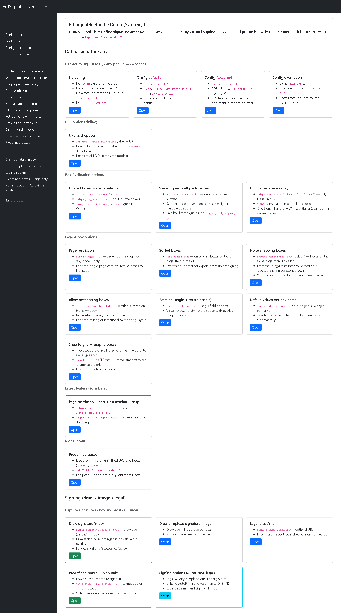
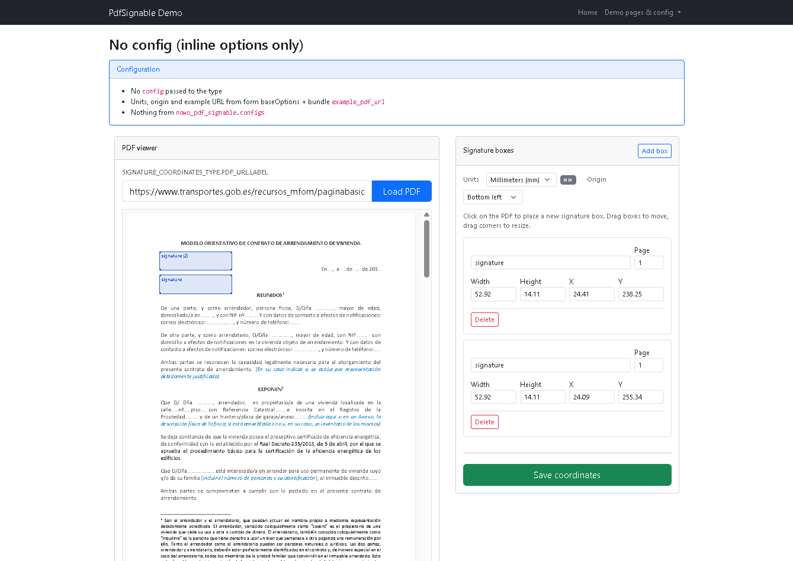

# PdfSignable Bundle

[](https://github.com/nowo-tech/PdfSignableBundle/actions/workflows/ci.yml) [](LICENSE) [](https://php.net) [](https://symfony.com) [](https://github.com/nowo-tech/pdfSignableBundle)

> ⭐ **Found this project useful?** Give it a star on GitHub! It helps us maintain and improve the project.

**Symfony bundle to define signature coordinates on PDFs.** A form type that accepts a PDF URL, renders the document in the browser with PDF.js, and lets users place signature boxes by clicking on the page (drag to move, drag corners to resize). Ideal for configuring where signatures must appear in PDF documents before sending them to sign.

> 📋 **Compatible with Symfony 6.1+, 7.x, and 8.x** — This bundle requires Symfony 6.1 or higher and PHP 8.1+.

## What is this?

This bundle helps you **define signature box coordinates on PDFs** in your Symfony applications for:

- 📄 **PDF signature placement** — Let users visually place and resize signature areas on a PDF
- 📐 **Units and origin** — Work in mm, cm, pt, px or in; choose coordinate origin (e.g. bottom-left)
- 🔗 **External PDFs** — Optional proxy to load external PDFs without CORS issues
- ⚙️ **Named configs** — Reuse presets (fixed URL, units, limits) via `config: 'name'` in YAML
- ✅ **Validation** — Required box names, unique names per form, min/max entries
- 🎯 **Events** — Hook into proxy request/response and coordinate submission for custom logic

## Quick Search Terms

Looking for: **PDF signature coordinates**, **signature box placement**, **PDF.js Symfony**, **PDF form coordinates**, **signature position configurator**, **Symfony PDF viewer**, **signature overlay**, **PDF signing workflow**, **coordinate picker**, **document signing**? You've found the right bundle!

## Features

- ✅ **Form type** — `SignatureCoordinatesType` with PDF URL, units (mm, cm, pt, px, in), coordinate origin (corners) and collection of signature boxes
- ✅ **PDF viewer** — In-browser viewer (PDF.js) with overlays for each box; click to add, drag to move, drag corners to resize
- ✅ **Optional proxy** — Load external PDFs without CORS; configurable via `nowo_pdf_signable.proxy_enabled`
- ✅ **Named configurations** — Define presets in `nowo_pdf_signable.configs` and use `config: 'name'` when adding the form type
- ✅ **URL modes** — Free-text URL input or dropdown choice (`url_mode: choice`, `url_choices`)
- ✅ **Box options** — Name as text or dropdown (`name_mode: choice`); min/max entries; optional **unique box names** validation; **page restriction** (`allowed_pages`); **sort order** on submit (`sort_boxes`); **no overlapping boxes** (`prevent_box_overlap`, default true); **optional rotation** (`enable_rotation`); **default values per name** (`box_defaults_by_name`); **snap to grid** (`snap_to_grid`) and **snap to other boxes** (`snap_to_boxes`, default true)
- ✅ **Viewer** — **Thumbnails**: page strip to jump to a page; **Zoom**: toolbar (zoom in, zoom out, fit width, translated); **Touch**: pinch to zoom, two-finger pan on tablets
- ✅ **Validation** — Required box name (NotBlank); `unique_box_names` global (`true`/`false`) or per-name (array) to enforce unique box names
- ✅ **Events** — `PdfProxyRequestEvent`, `PdfProxyResponseEvent`, `SignatureCoordinatesSubmittedEvent` for integration
- ✅ **Compatibility** — Symfony 6.1+, 7.x, 8.x and PHP 8.1+

## Screenshots

**Demo index** — Each card shows a different way to configure `SignatureCoordinatesType` (named configs, URL options, box validation, model prefill):



**Signature coordinates form** — PDF viewer with draggable signature boxes; unit/origin selector and box list on the right:



## Installation

Install the bundle with Composer:

```bash
composer require nowo-tech/pdf-signable-bundle
```

With [Symfony Flex](https://symfony.com/doc/current/setup/flex.html) the bundle is registered automatically. Otherwise register it and import the routes — see [Installation](docs/INSTALLATION.md).

**Development / unreleased:** To use the latest `main` branch before the next tag, add the VCS repository and require `dev-main` (see [docs/INSTALLATION.md](docs/INSTALLATION.md)).

## Quick Start

1. **Add the form type** to your form (or use the default route `/pdf-signable`):

```php
use Nowo\PdfSignableBundle\Form\SignatureCoordinatesType;
use Nowo\PdfSignableBundle\Model\SignatureCoordinatesModel;

$model = new SignatureCoordinatesModel();
$form = $this->createForm(SignatureCoordinatesType::class, $model);
// Or use a named config: ['config' => 'fixed_url']
```

2. **Render the form** with the bundle form theme so the PDF viewer and boxes render correctly:

```twig

{{ form_widget(form.signatureCoordinates) }}
```

3. **On submit** you get a `SignatureCoordinatesModel` with `pdfUrl`, `unit`, `origin` and `signatureBoxes` (each with name, page, x, y, width, height, and angle when `enable_rotation` is true).

Configure `nowo_pdf_signable` (proxy, example URL, optional [named configs](docs/CONFIGURATION.md)) as needed. See [Usage](docs/USAGE.md) for full options and examples.

## Requirements

- PHP >= 8.1
- **Symfony >= 6.1** || >= 7.0 || >= 8.0
- Extensions: `form`, `http-client`, `twig`, `translation`, `validator`, `yaml`

## Configuration

The bundle works with default settings. Create or edit `config/packages/nowo_pdf_signable.yaml`:

```yaml
nowo_pdf_signable:
    proxy_enabled: true                    # Enable proxy for external PDFs (avoids CORS)
    example_pdf_url: ''                    # Optional default URL for form preload
    configs: {}                            # Optional named configs (see CONFIGURATION.md)
```

See [CONFIGURATION.md](docs/CONFIGURATION.md) for detailed options and named configs.

## Demos

Dockerized demos (Symfony 7 and 8, Bootstrap, Vite, TypeScript) with multiple usage examples. The [screenshots above](#screenshots) show the demo home (configuration cards) and the signature coordinates form (PDF viewer + boxes).

```bash
cd demo
make run-symfony7   # → http://localhost:8000
make run-symfony8   # → http://localhost:8001
```

Seventeen demos: no config, default config, fixed_url, overridden config, URL as dropdown, limited boxes, same signer (multiple locations), unique per name (array), page restriction, sorted boxes, no-overlap, allow-overlap, rotation, defaults-by-name, snap-to-grid, latest features (combined), predefined boxes. See [demo/README.md](demo/README.md) and [demo/Makefile](demo/Makefile).

### Xdebug

Demos include **Xdebug**. Your IDE should listen on port **9003**. To start only on demand, set `XDEBUG_START_WITH_REQUEST=trigger` in the demo `docker-compose.yml` and use your IDE trigger.

## Frontend (Vite + TypeScript)

The PDF viewer is built with **Vite** and **TypeScript**. The bundle ships a built file at `src/Resources/public/js/pdf-signable.js`. After installing the bundle:

```bash
php bin/console assets:install
```

To rebuild from source (bundle root):

```bash
pnpm install
pnpm run build
```

## Tests and QA

From the bundle root (optionally via Docker):

```bash
make up
make install
make test          # PHPUnit
make test-coverage # PHPUnit + HTML (coverage/) and Clover (coverage.xml). Requires PCOV in the container.
make cs-check      # PHP-CS-Fixer
make qa            # cs-check + test
make validate-translations  # Validate translation YAML files (inside Docker)
```

Or locally: `composer test`, `composer test-coverage`, `composer cs-check`, `composer qa`. The bundle Docker image includes PCOV for coverage.

## Documentation

- [Installation](docs/INSTALLATION.md) — Step-by-step installation and route registration
- [Configuration](docs/CONFIGURATION.md) — Proxy, example URL, named configs
- [Usage](docs/USAGE.md) — Form options, named configs, customization
- [Events](docs/EVENTS.md) — Proxy and submission events
- [Testing](docs/TESTING.md) — Test structure and code coverage
- [Changelog](docs/CHANGELOG.md) — Version history
- [Upgrading](docs/UPGRADING.md) — Upgrade instructions
- [Roadmap](docs/ROADMAP.md) — Possible improvements and future ideas
- [Accessibility](docs/ACCESSIBILITY.md) — Keyboard, screen readers, contrast
- [Release process](docs/RELEASE.md) — How to create a release and tag
- [Contributing](docs/CONTRIBUTING.md) — How to contribute
- [Security](docs/SECURITY.md) — Reporting vulnerabilities

## License

The MIT License (MIT). Please see [LICENSE](LICENSE) for more information.

## Contributing

We welcome contributions! Please see [CONTRIBUTING.md](docs/CONTRIBUTING.md) for details on how to contribute to this project. For security issues see [SECURITY.md](docs/SECURITY.md).

## Author

Created by [Héctor Franco Aceituno](https://github.com/HecFranco) at [Nowo.tech](https://nowo.tech)
