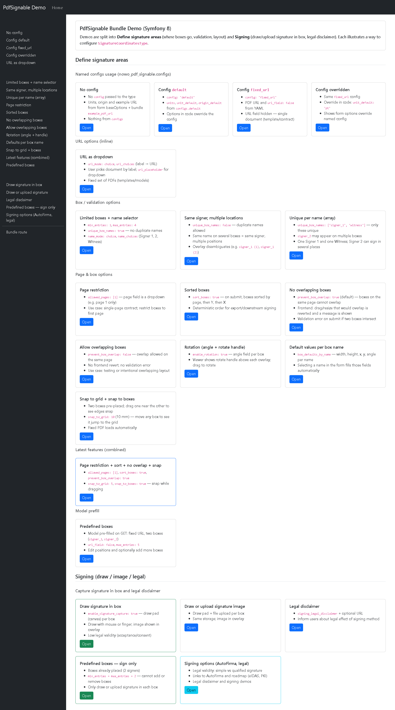
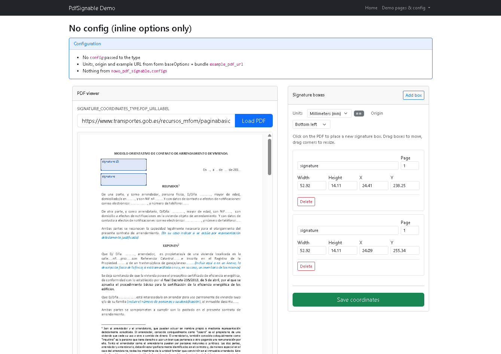
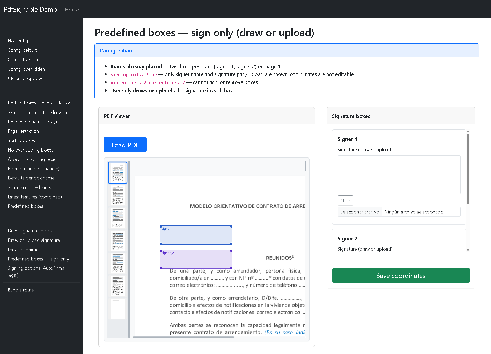

# PdfSignable Bundle

[](https://github.com/nowo-tech/PdfSignableBundle/actions/workflows/ci.yml) [](https://packagist.org/packages/nowo-tech/pdf-signable-bundle) [](https://packagist.org/packages/nowo-tech/pdf-signable-bundle) [](LICENSE) [](https://php.net) [](https://symfony.com) [](https://github.com/nowo-tech/PdfSignableBundle) [](#tests-and-coverage)

> ⭐ **Found this useful?** [Install from Packagist](https://packagist.org/packages/nowo-tech/pdf-signable-bundle) · Give it a star on [GitHub](https://github.com/nowo-tech/PdfSignableBundle) to help others find it.

**Symfony bundle to define signature box coordinates on PDFs.** Form type with an in-browser PDF.js viewer: users place and resize signature areas by clicking and dragging. Supports units (mm, cm, pt), validation, proxy for external PDFs, and hooks for PKI/timestamp/batch signing. Symfony 6.1+, 7.x, 8.x · PHP 8.1+.

## What is this?

This bundle helps you **define signature box coordinates on PDFs** in your Symfony applications for:

- 📄 **PDF signature placement** — Let users visually place and resize signature areas on a PDF
- 📐 **Units and origin** — Work in mm, cm, pt, px or in; choose coordinate origin (e.g. bottom-left)
- 🔗 **External PDFs** — Optional proxy to load external PDFs without CORS issues
- ⚙️ **Named configs** — Reuse presets (fixed URL, units, limits) via `config: 'name'` in YAML
- ✅ **Validation** — Required box names, unique names per form, min/max entries
- 🎯 **Events** — Hook into proxy request/response and coordinate submission for custom logic

## Quick Search Terms

Looking for: **PDF signature coordinates**, **signature box placement**, **PDF.js Symfony**, **PDF form coordinates**, **signature position configurator**, **Symfony PDF viewer**, **signature overlay**, **PDF signing workflow**, **coordinate picker**, **document signing**? You've found the right bundle!

## Features

- ✅ **Form type** — `SignatureCoordinatesType` with PDF URL, units (mm, cm, pt, px, in), coordinate origin (corners) and collection of signature boxes
- ✅ **PDF viewer** — In-browser viewer (PDF.js) with overlays for each box; click to add, drag to move, drag corners to resize
- ✅ **Optional proxy** — Load external PDFs without CORS; configurable via `nowo_pdf_signable.proxy_enabled`
- ✅ **Named configurations** — Define presets in `nowo_pdf_signable.signature.configs` (or `acroform.configs`) and use `config: 'alias'` when adding the form type
- ✅ **URL modes** — Free-text URL input or dropdown choice (`url_mode: choice`, `url_choices`)
- ✅ **Box options** — Name as text or dropdown (`name_mode: choice`); min/max entries; optional **unique box names** validation; **page restriction** (`allowed_pages`); **sort order** on submit (`sort_boxes`); **no overlapping boxes** (`prevent_box_overlap`, default true); **minimum box size** (`min_box_width`, `min_box_height`); **optional rotation** (`enable_rotation`); **default values per name** (`box_defaults_by_name`); **snap to grid** (`snap_to_grid`) and **snap to other boxes** (`snap_to_boxes`, default true); **guides and grid** (`show_grid`, `grid_step`); **viewer lazy load** (`viewer_lazy_load`); **batch signing** (`batch_sign_enabled`, “Sign all” button). **Audit**: optional fill from request (`audit.fill_from_request`), placeholders for TSA and signing service (see [SIGNING_ADVANCED](docs/SIGNING_ADVANCED.md))
- ✅ **Viewer** — **Thumbnails**: page strip to jump to a page; **Zoom**: toolbar (zoom in, zoom out, fit width, translated); **Touch**: pinch to zoom, two-finger pan on tablets
- ✅ **Validation** — Required box name (NotBlank); `unique_box_names` global (`true`/`false`) or per-name (array) to enforce unique box names
- ✅ **Events** — `PdfProxyRequestEvent`, `PdfProxyResponseEvent`, `SignatureCoordinatesSubmittedEvent`, `BatchSignRequestedEvent`, `PdfSignRequestEvent` for integration (see [EVENTS](docs/EVENTS.md) and [SIGNING_ADVANCED](docs/SIGNING_ADVANCED.md))
- ✅ **Compatibility** — Symfony 6.1+, 7.x, 8.x and PHP 8.1+

## Screenshots

**Demo index** — Each card shows a different way to configure `SignatureCoordinatesType` (named configs, URL options, box validation, model prefill):



**Signature coordinates form** — PDF viewer with draggable signature boxes; unit/origin selector and box list on the right:



**Signature form (alternate view)** — Same form with thumbnails strip, zoom toolbar and optional rotation; boxes can be placed flush to page edges at any angle:



## Installation

```bash
composer require nowo-tech/pdf-signable-bundle
```

[Symfony Flex](https://symfony.com/doc/current/setup/flex.html) registers the bundle automatically. Otherwise see [Installation](docs/INSTALLATION.md) to register the bundle and routes.

**Unreleased / dev:** To use the latest default branch (`main` or `master`), add the VCS repo and require `dev-main` or `dev-master` — see [docs/INSTALLATION.md](docs/INSTALLATION.md).

## Quick Start

1. **Add the form type** to your form (or use the default route `/pdf-signable`):

```php
use Nowo\PdfSignableBundle\Form\SignatureCoordinatesType;
use Nowo\PdfSignableBundle\Model\SignatureCoordinatesModel;

$model = new SignatureCoordinatesModel();
$form = $this->createForm(SignatureCoordinatesType::class, $model);
// Or use a named config: ['config' => 'fixed_url']
```

2. **Render the form** with the bundle form theme so the PDF viewer and boxes render correctly:

```twig

{{ form_widget(form.signatureCoordinates) }}
```

3. **On submit** you get a `SignatureCoordinatesModel` with `pdfUrl`, `unit`, `origin` and `signatureBoxes` (each with name, page, x, y, width, height, and angle when `enable_rotation` is true).

Configure `nowo_pdf_signable` (proxy, example URL, optional [named configs](docs/CONFIGURATION.md)) as needed. See [Usage](docs/USAGE.md) for full options and examples.

## Requirements

- PHP >= 8.1
- **Symfony >= 6.1** || >= 7.0 || >= 8.0
- PHP extensions required by Symfony (e.g. json, mbstring, ctype, xml, fileinfo). **Optional:** `ext-yaml` for faster YAML config parsing (see `composer suggest`)

## Configuration

The bundle works with default settings. Create or edit `config/packages/nowo_pdf_signable.yaml`:

```yaml
nowo_pdf_signable:
  proxy_enabled: true  # Proxy route for external PDFs (avoids CORS)
  # example_pdf_url: bundle default is a sample public PDF URL; set to '' to disable preload
  # debug: false    # Browser console logging for the viewer (default false)
  signature:
    configs: {}    # Named presets; see CONFIGURATION.md
```

See [CONFIGURATION.md](docs/CONFIGURATION.md) for the full tree (`proxy_url_allowlist`, `audit`, `tsa_url`, `signing_service_id`, `acroform.*`, etc.) and default values.

## Demos

Dockerized demos (Symfony 7 and 8, Bootstrap, Vite, TypeScript) with multiple usage examples. They run with **FrankenPHP** (Caddy + PHP): the **Dockerfile** ships a production Caddyfile with **`php_server` worker**, but with **`APP_ENV=dev`** the container **entrypoint swaps in `Caddyfile.dev`** (no worker, cache-busting headers) so local dev matches [docs/DEMO-FRANKENPHP.md](docs/DEMO-FRANKENPHP.md). Served over **HTTPS** on localhost (self-signed certificate; accept it in the browser). The [screenshots above](#screenshots) show the demo home (configuration cards), the signature coordinates form (PDF viewer + boxes), and an alternate view with thumbnails, zoom and rotation.

```bash
cd demo
make run-symfony7  # → https://localhost:8001
make run-symfony8  # → https://localhost:8002
```

Twenty-plus demos: no config, default config, fixed_url, overridden config, URL as dropdown, limited boxes, same signer (multiple locations), unique per name (array), page restriction, sorted boxes, no-overlap, allow-overlap, **min-size-boxes**, rotation, defaults-by-name, snap-to-grid, **guides-and-grid**, **viewer lazy-load**, **AcroForm editor**, **AcroForm editor min-size**, latest features (combined), predefined boxes; plus signing (draw, upload, legal disclaimer, predefined boxes — sign only, signing options). See [demo/README.md](demo/README.md) and [demo/Makefile](demo/Makefile).

### Xdebug

Demos include **Xdebug**. Your IDE should listen on port **9003**. To start only on demand, set `XDEBUG_START_WITH_REQUEST=trigger` in the demo `docker-compose.yml` and use your IDE trigger.

## Frontend (Vite + TypeScript)

The PDF viewer is built with **Vite** and **TypeScript**. The bundle ships a built file at `src/Resources/public/js/pdf-signable.js`. After installing the bundle:

```bash
php bin/console assets:install
```

To rebuild from source (bundle root):

```bash
pnpm install
pnpm run build
```

## Tests and QA

From the bundle root (optionally via Docker):

```bash
make up
make install
make test     # PHPUnit
make test-coverage # PHPUnit + HTML (coverage/) and Clover (coverage.xml). Requires PCOV in the container.
make cs-check   # PHP-CS-Fixer
make qa      # cs-check + test
make validate-translations # Validate translation YAML files (inside Docker)
```

Or locally: `composer test`, `composer test-coverage`, `composer cs-check`, `composer qa`. The bundle Docker image includes PCOV for coverage.

## Documentation

- [Installation](docs/INSTALLATION.md)
- [Configuration](docs/CONFIGURATION.md)
- [Usage](docs/USAGE.md)
- [Contributing](docs/CONTRIBUTING.md)
- [Changelog](docs/CHANGELOG.md)
- [Upgrading](docs/UPGRADING.md)
- [Release](docs/RELEASE.md)
- [Security](docs/SECURITY.md)
- [Engram](docs/ENGRAM.md)
- [Roadmap](docs/ROADMAP.md)

### Additional documentation

- [Demo with FrankenPHP (development and production)](docs/DEMO-FRANKENPHP.md)
- [Workflow](docs/WORKFLOW.md)
- [AcroForm backend](docs/ACROFORM_BACKEND_EXTENSION.md)
- [Events](docs/EVENTS.md)
- [Advanced signing](docs/SIGNING_ADVANCED.md)
- [Styles](docs/STYLES.md)
- [Testing](docs/TESTING.md)
- [Accessibility](docs/ACCESSIBILITY.md)

## Tests and coverage

- Tests: PHPUnit (PHP), pytest (Python scripts)
- PHP: 99.18%
- TS/JS: 81.28%
- Python: 21%

## License

The MIT License (MIT). Please see [LICENSE](LICENSE) for more information.

## Contributing

We welcome contributions! Please see [CONTRIBUTING.md](docs/CONTRIBUTING.md) for details on how to contribute to this project. For security issues see [SECURITY.md](docs/SECURITY.md).

## Author

Created by [Héctor Franco Aceituno](https://github.com/HecFranco) at [Nowo.tech](https://nowo.tech)
