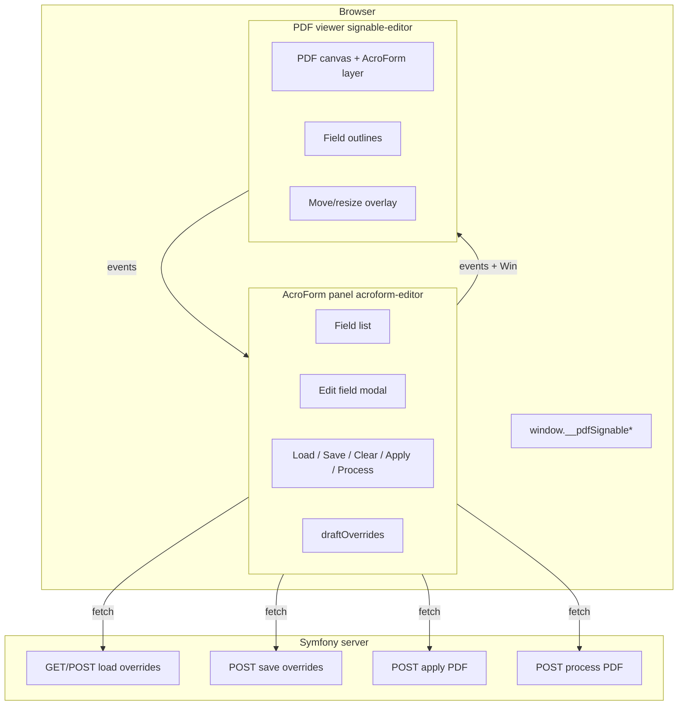
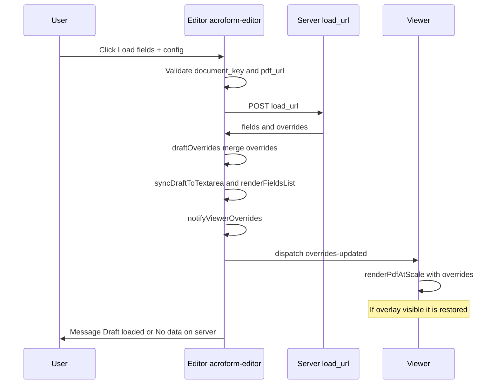
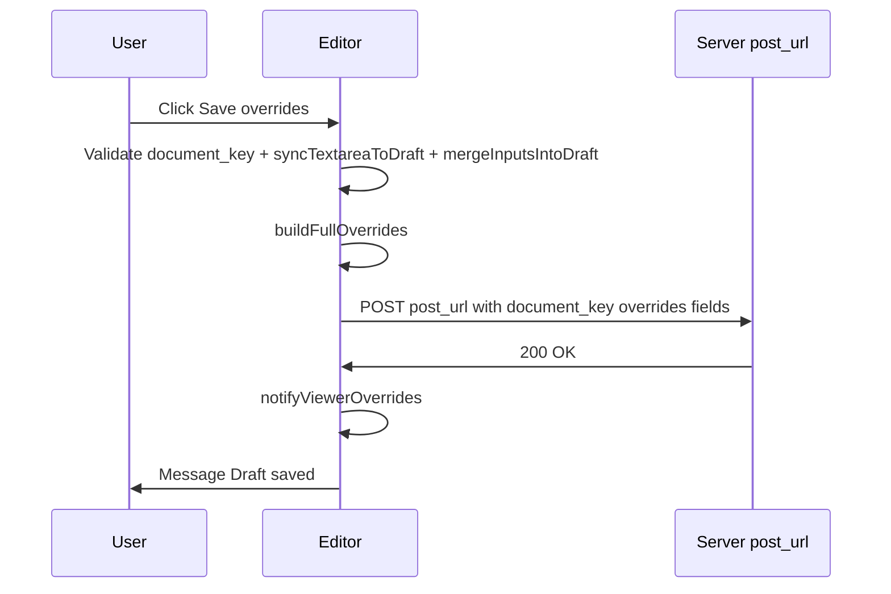
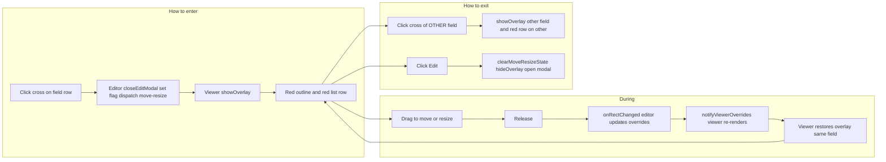
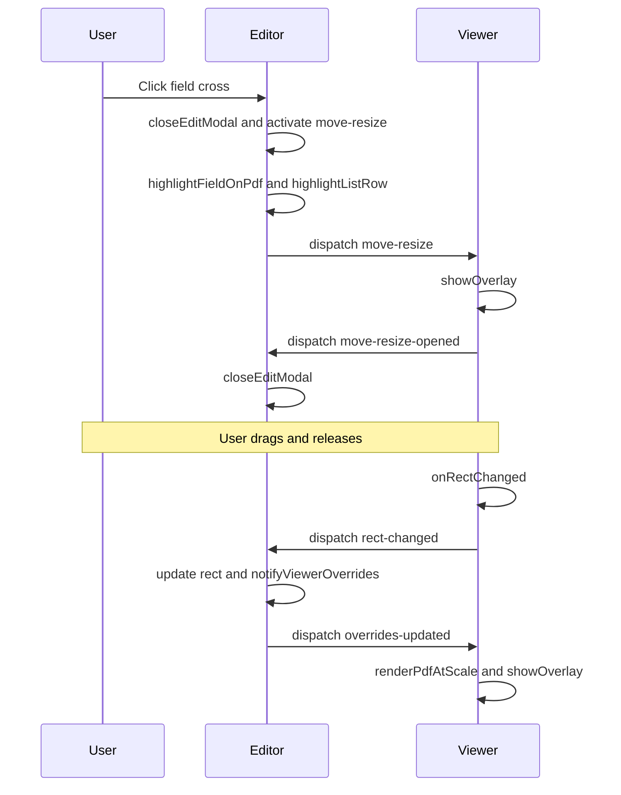
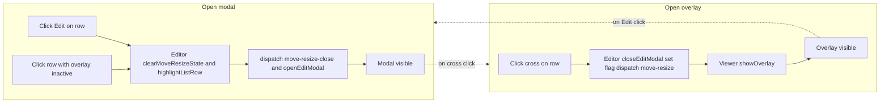
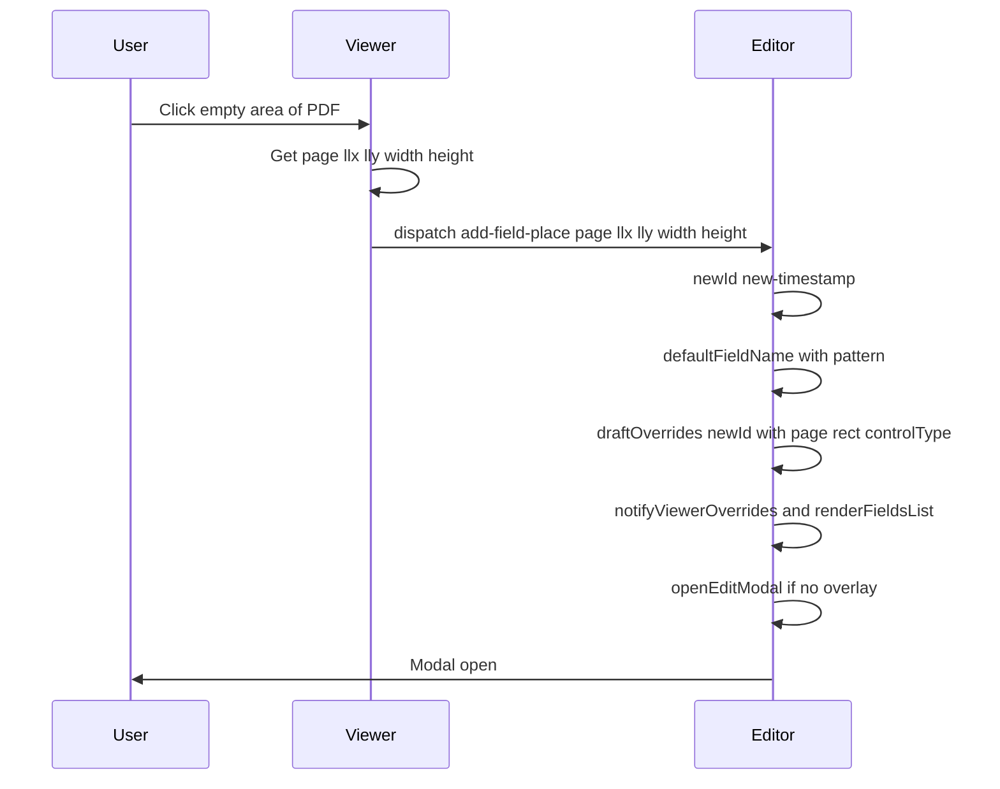
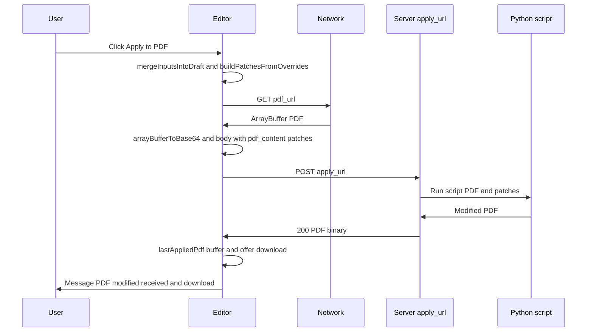
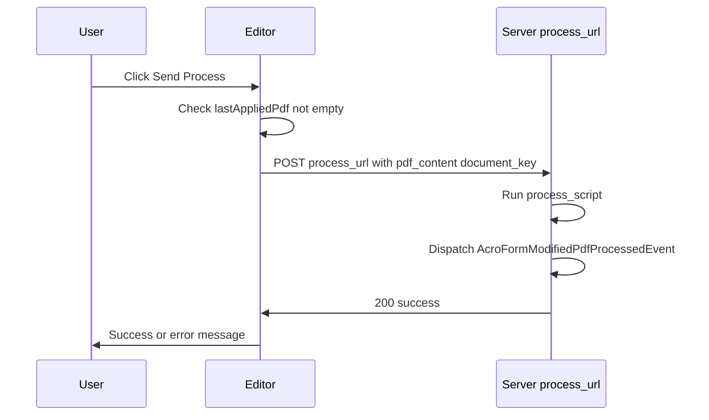
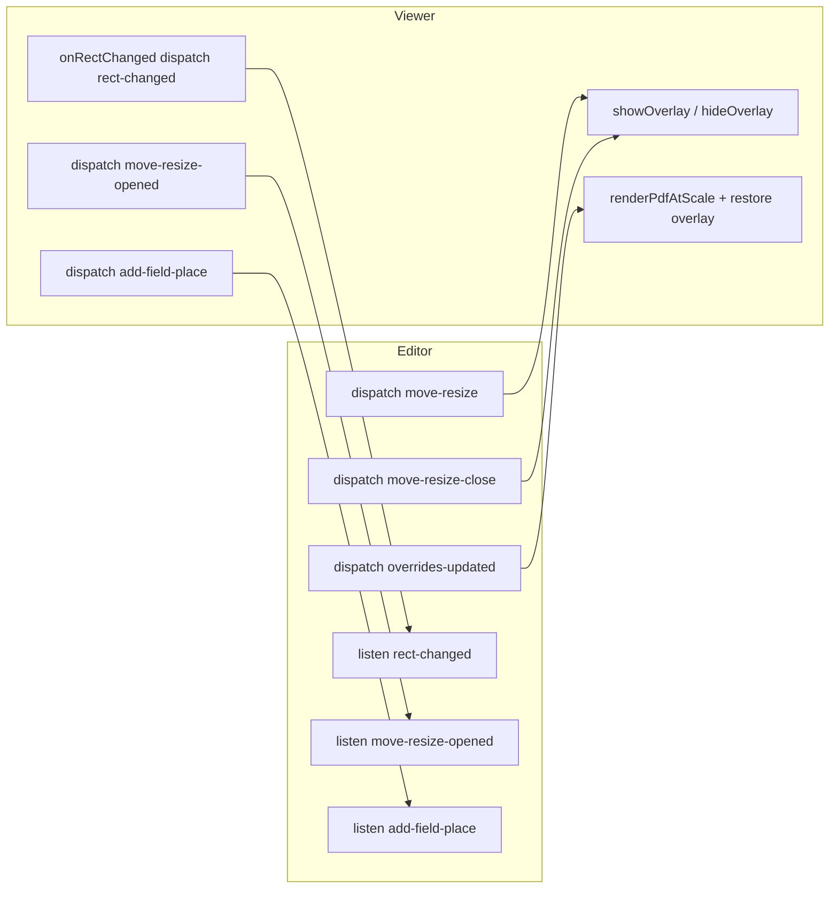

# AcroForm: flow diagrams and behaviour

This document describes **unambiguously** how the AcroForm editor works: architecture, data flows, state and events between the editor panel, the PDF viewer and the backend. It includes Mermaid diagrams for each flow.

---

## 1. General architecture

The AcroForm editor is made of **three parts** that communicate via events and global variables in the browser, and via HTTP with the server.

- **Editor panel:** field list, edit modal, Load/Save/Clear/Apply/Process buttons, and the override draft in memory (`draftOverrides`).
- **Viewer:** renders the PDF and the AcroForm layer (outlines and inputs); shows the move/resize overlay when applicable.
- **In-browser communication:** custom events (`pdf-signable-acroform-*`) and variables on `window` (`__pdfSignableAcroFormOverrides`, `__pdfSignableAcroFormMoveResizeFieldId`, etc.). See [Frontend events](#9-frontend-events-editor--viewer).

---

## 2. Load overrides

The user enters **document_key** and has the PDF loaded. When they click **Load fields + config**, the server is asked for stored overrides for that document and the draft and list are updated.

- **load_url** is typically the endpoint that returns overrides by `document_key` (and optionally the extractor field list).
- The field list is ordered **by page** and, within each page, top to bottom.

---

## 3. Save overrides

The current draft is sent to the server to persist it (session, DB, etc.). The viewer is already using that draft; save only persists.

---

## 4. Move / resize a field

**Rule:** you can only enter move/resize mode from the **cross** button for that field in the list. The overlay does not open when clicking the field outline on the PDF.

- The field stays **highlighted** (red outline on the PDF and **red row in the list**) until you choose another field (another cross) or click **Edit**.
- After releasing the drag, the overlay **does not close**: the PDF is re-rendered with the new `rect` and the **overlay is shown again** on the same field (so it stays linked).

---

## 5. Edit field configuration (modal)

Only **one** of the two contexts can be active: **edit modal** or **move/resize overlay**. Opening one closes the other.

- **Click on row:** opens the modal **only if** there is no active move/resize overlay (`__pdfSignableAcroFormMoveResizeFieldId` undefined).
- **Click Edit:** closes the overlay (if any), clears move/resize state and opens the modal.

---

## 6. Add a new field

The user clicks on an **empty area** of the PDF (not on a field). An override is created with id `new-<timestamp>`, default name by **pattern** (e.g. "New field 1", "New field 2") and the edit modal opens for that field.

- The default name is **translatable** (`new_field_name_pattern` with `%n`).
- In the modal the user can change the name and other properties.

---

## 7. Apply changes to PDF (Apply)

The frontend fetches the PDF (by URL), builds the **patches** list from `draftOverrides` and sends it to the server. The server (or Python script) returns the modified PDF. Fields with id `new-*` are sent with `createIfMissing: true` so the script creates them in the PDF.

---

## 8. Send / process PDF (Process)

The **last applied PDF** (`lastAppliedPdf`) is sent to the process endpoint (e.g. a script that fills or signs). The backend consumes the result (event `AcroFormModifiedPdfProcessedEvent`).

---

## 9. Frontend events (editor ↔ viewer)

All are **CustomEvent** on `window`. The editor and viewer coordinate only via these events and the global variables below.

| Event | Source | Target | Effect |
|-------|--------|--------|--------|
| `pdf-signable-acroform-move-resize` | Editor | Viewer | Shows move/resize overlay for the given field. |
| `pdf-signable-acroform-move-resize-close` | Editor | Viewer | Removes the overlay and clears `__pdfSignableAcroFormMoveResizeFieldId` and `__pdfSignableAcroFormMoveResizePage`. |
| `pdf-signable-acroform-move-resize-opened` | Viewer (move-resize) | Editor | Closes the edit modal (single active context). |
| `pdf-signable-acroform-overrides-updated` | Editor | Viewer | Re-renders the PDF with current overrides; restores overlay if one was active. |
| `pdf-signable-acroform-rect-changed` | Viewer | Editor | Updates `draftOverrides[fieldId].rect` and re-renders list; does not clear move/resize flag. |
| `pdf-signable-acroform-add-field-place` | Viewer | Editor | Creates override for new field and opens modal. |
| `pdf-signable-acroform-field-focused` | Viewer | Editor | Highlights outline and row when focusing an input on the PDF. |
| `pdf-signable-acroform-fields-updated` | Viewer | Editor | PDF field list updated; editor can Load or refresh list. |
| `pdf-signable-acroform-edit-mode` | Editor | Viewer | Toggles `acroform-edit-mode` class on the widget (currently edit mode is always on when the editor is present). |

### Global variables (window)

| Variable | Use |
|----------|-----|
| `__pdfSignableAcroFormOverrides` | Override map applied by the viewer when rendering. Written by the editor. |
| `__pdfSignableAcroFormFields` | Field descriptor list exposed by the viewer for the editor. |
| `__pdfSignableAcroFormEditMode` | Edit mode on (currently always `true` when the editor is present). |
| `__pdfSignableAcroFormMoveResizeFieldId` | Id of the field that has the move/resize overlay visible. |
| `__pdfSignableAcroFormMoveResizePage` | Page of that field; used to restore the overlay after re-render. |

---

## 10. Field list order

The list is **ordered by page** (ascending) and, within each page, **top to bottom** in the PDF (higher Y first). Ordering is applied in `renderFieldsList` before rendering the rows.

---

## 11. Quick summary

| Action | Where | Effect |
|--------|--------|--------|
| Load | Editor | Loads overrides from server and updates list and viewer. |
| Save | Editor | Saves `draftOverrides` to the server. |
| Clear | Editor | Clears the draft and notifies the viewer. |
| Edit (pencil) | Editor | Closes overlay (if any), opens modal for that field. |
| Cross (move/resize) | Editor | Closes modal (if any), shows overlay; field and row in red until changing field or Edit. |
| Click row | Editor | Highlights field on PDF; opens modal only if no overlay active. |
| Click empty PDF | Viewer | Adds new field with pattern name and opens modal. |
| Apply to PDF | Editor | Sends PDF + patches to server; downloads modified PDF. |
| Send / Process | Editor | Sends last applied PDF to process_url. |

For backend PHP events (apply, process, etc.) see [EVENTS](EVENTS.md). For AcroForm configuration and backend see [ACROFORM_BACKEND_EXTENSION](ACROFORM_BACKEND_EXTENSION.md) and [CONFIGURATION](CONFIGURATION.md).
