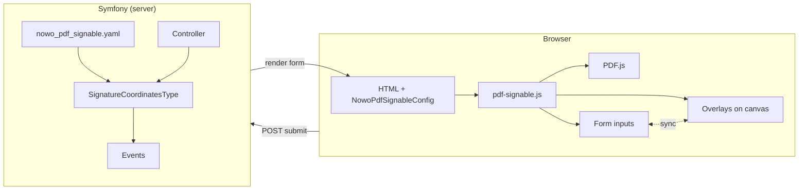
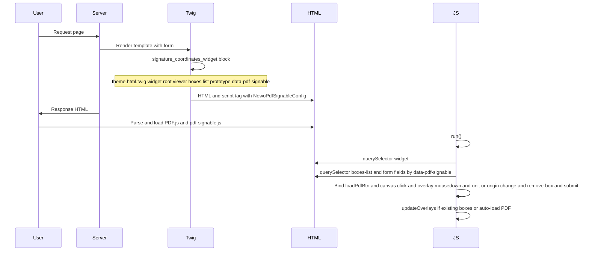
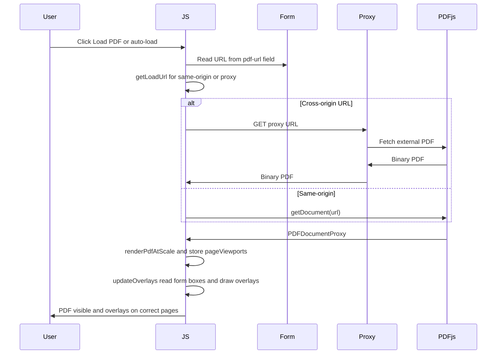
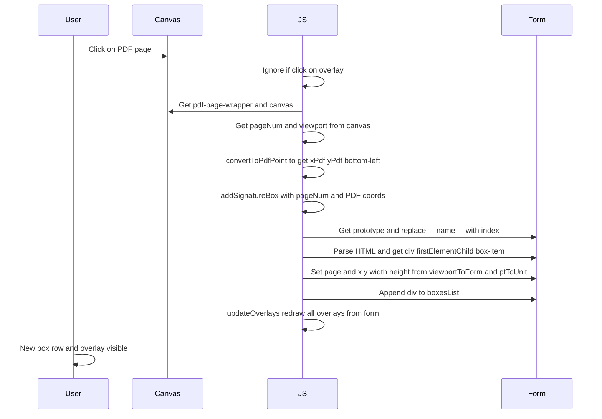
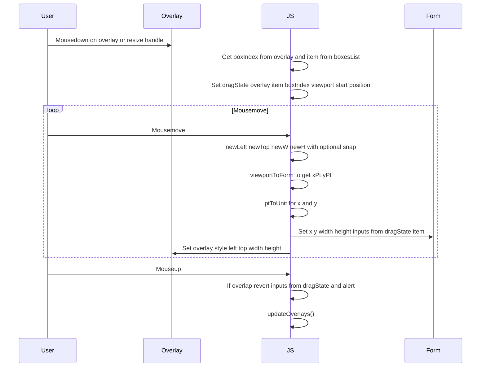
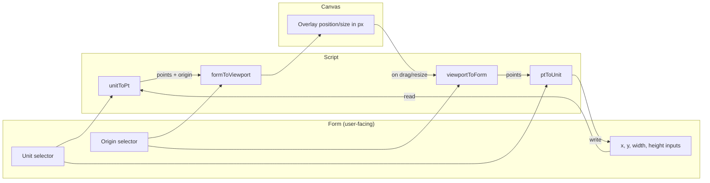
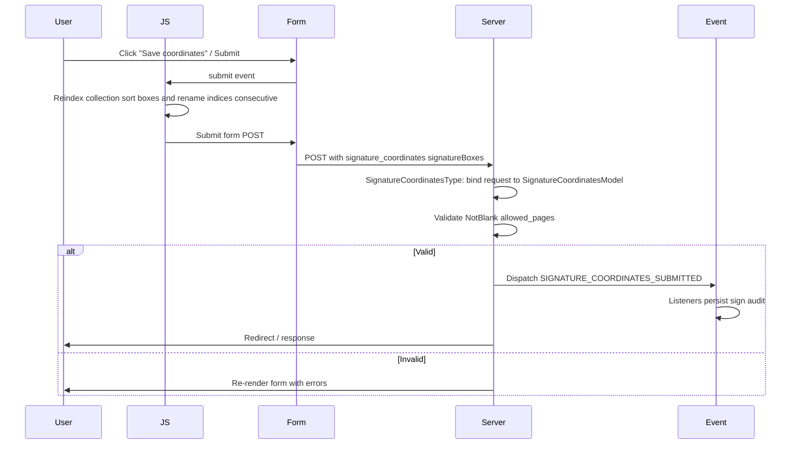

# Workflow

This document describes the main flows of the PdfSignable bundle: how the page is built, how the viewer and form stay in sync, and what happens on submit.

## High-level architecture

- **Server:** configuration and form type produce the widget HTML and inject options (proxy URL, strings, debug). The form type adds `data-pdf-signable` attributes so the script can find elements.
- **Browser:** the script reads the config, finds the widget and list by `data-pdf-signable`, loads the PDF (via URL or proxy), draws overlays from form values, and keeps form and overlays in sync on add/drag/resize.

---

## Page load and script init

1. The form theme outputs the widget (viewer + list) and injects `NowoPdfSignableConfig`.
2. When the script runs, it finds the widget and list by `data-pdf-signable`, reads unit/origin from the form, and binds events.
3. If the form already has boxes (e.g. edit mode), it builds overlays from the current input values.

---

## Load PDF

- The script gets the URL from the form. If it is cross-origin, it uses the bundle proxy to avoid CORS.
- After the PDF is loaded, it renders pages and then rebuilds overlays from the form (page, x, y, width, height in the selected unit/origin).

---

## Add signature box (click on canvas)

- The click is interpreted as the **bottom-left** of the new box in PDF space. The script converts that to form coordinates (using the current unit and origin), fills the prototype row, appends it, and refreshes overlays.
- The link between overlay and form row is the **index**: overlay `data-box-index="i"` corresponds to the i-th element with `data-pdf-signable="box-item"` in the list.

---

## Drag or resize overlay

- The script identifies the form row from the overlay’s `data-box-index` and keeps a reference to that DOM node (`dragState.item`).
- On each mousemove it converts the new viewport position/size to form coordinates (viewportToForm + ptToUnit) and writes to the inputs found by `data-pdf-signable="x"`, `"y"`, `"width"`, `"height"`.
- On mouseup it can revert if overlap is not allowed; then it rebuilds overlays so they match the (possibly reverted) form.

---

## Coordinate sync (form ↔ overlay)

The form stores **x, y, width, height** in the **selected unit** (mm, cm, pt, etc.) and with the **selected origin** (e.g. bottom_left = bottom-left corner of the box). The canvas and PDF.js use **viewport pixels** and **PDF points** (bottom-left origin). The script converts both ways:

- **Form → overlay:** read x, y, width, height (in unit); convert to points (`unitToPt`); convert to viewport position with `formToViewport(viewport, xPt, yPt, wPt, hPt, origin)`; set overlay `left`, `top`, `width`, `height` in pixels.
- **Overlay → form:** on drag/resize, new `left`, `top`, `width`, `height` in pixels; convert to PDF points and then to form coordinates with `viewportToForm`; convert points to unit with `ptToUnit`; write back to the inputs.

---

## Form submit

- Before submit, the script **reindexes** the collection (e.g. by page, then y, then x) so the server receives `[0]`, `[1]`, … without gaps.
- The server validates and, if valid, dispatches `SignatureCoordinatesSubmittedEvent` so you can persist, call a signing service, or add audit data. See [EVENTS](EVENTS.md).

---

## References

- [USAGE](USAGE.md) — Form type, options, overriding templates, data attributes.
- [CONFIGURATION](CONFIGURATION.md) — `nowo_pdf_signable` options.
- [EVENTS](EVENTS.md) — Event list and listener examples.
